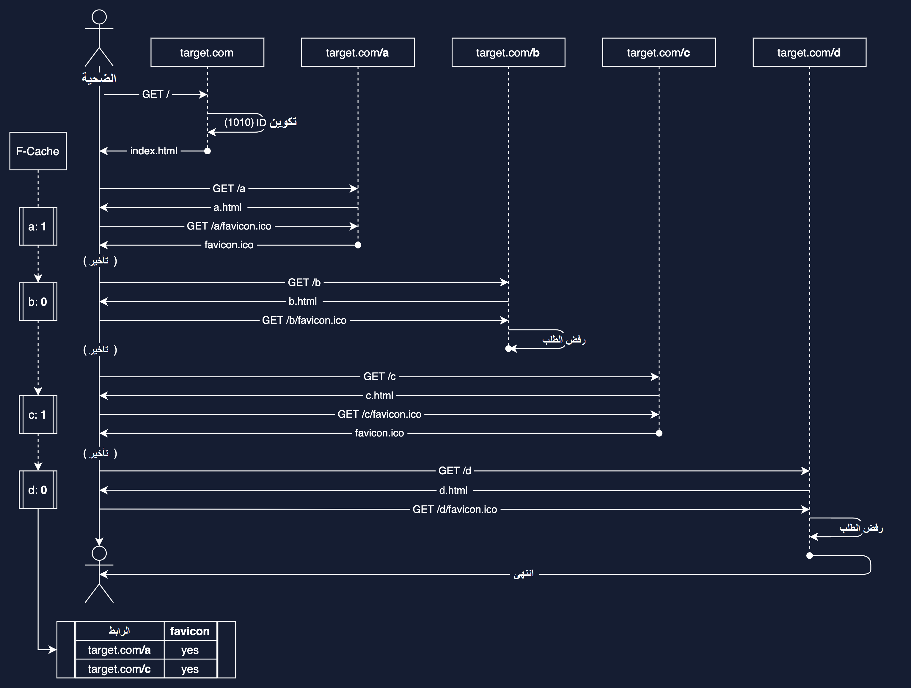
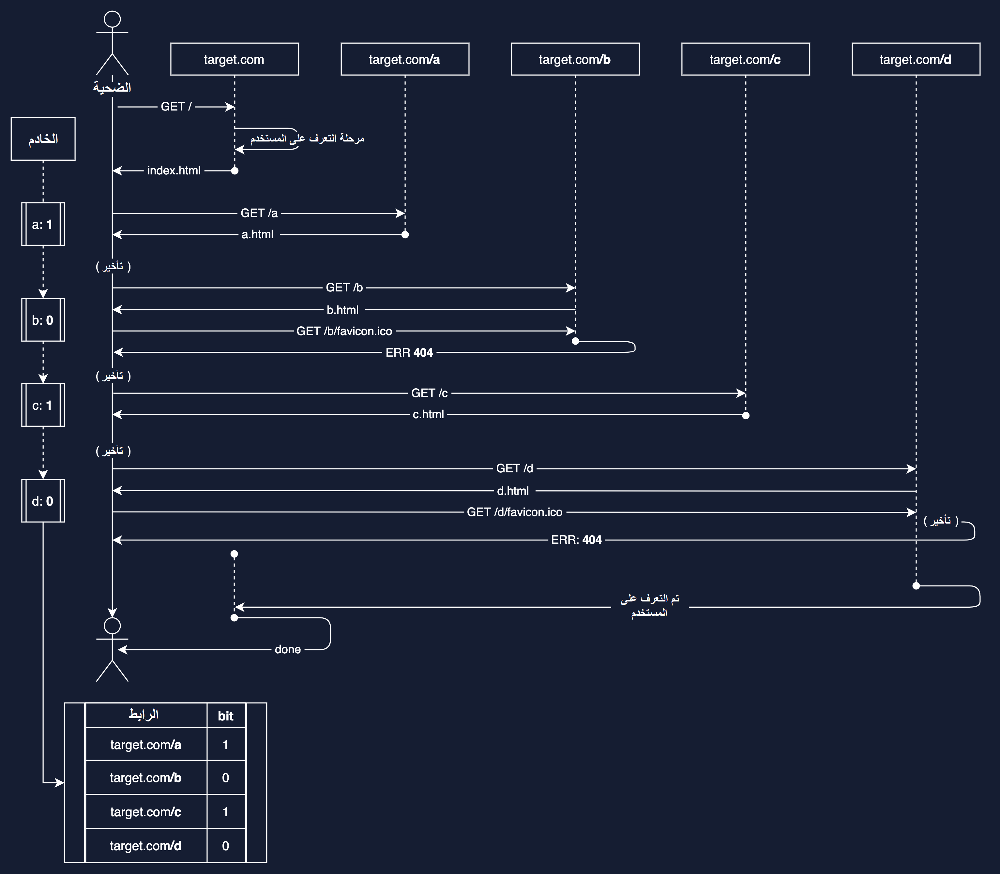
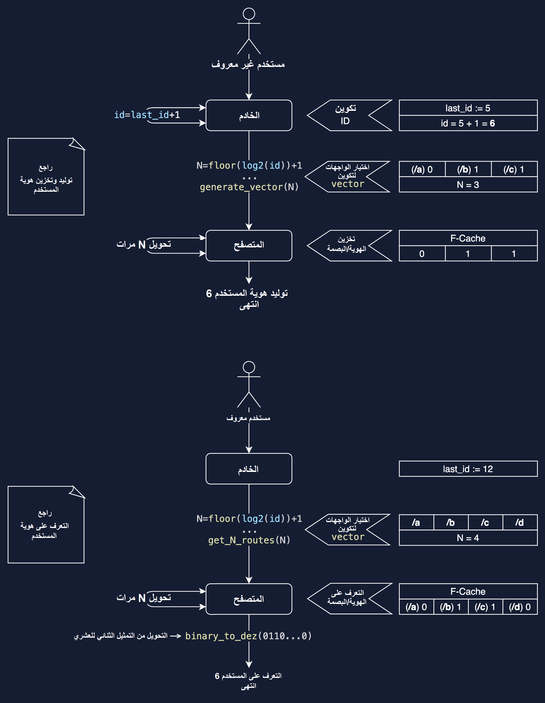

<div dir="rtl">

# كيف تستطيع المواقع تتبعك من خلال الأيقونات


ملاحظة: هذه المقالة مترجمة بإذن من ناشرها. يمكنك قراءة المقالة الأصلية باللغة الانجليزية من [هنا](https://supercookie.me/workwise).

<div dir="ltr">

Note: This article is translated with permission from the author. The original English article can be found [here](https://supercookie.me/workwise).

</div>

---

للمزيد من التفاصيل، الرجاء الاطلاع على [الورقة البحثية من جامعة ايلينوي](https://www.cs.uic.edu/~polakis/papers/solomos-ndss21.pdf).

## مقدمة

متصفحات الانترنت هي الأدوات الأكثر انتشارًا التي تسمح لنا بالوصول إلى شبكة الانترنت. على مر الزمان، أدى تطور شبكة الانترنت إلى إحداث خصائص وواجهات برمجية جديدة في المتصفحات، الأمر الذي فتح مجالات كثيرة لجمع وتحليل مختلف أنواع البيانات عن مستخدمي هذه المتصفحات.

بدايةً، جمع البيانات ليس بالأمر السيئ. جميعنا نقوم بجمع مختلف المعلومات من حولنا، سواء من معارفنا وأصدقائنا أو من بيئة الدراسة والعمل أو من وسائل المعرفة المختلفة، من أجل ربطها وتحليلها للوصول إلى حقائق واستنتاجات، وهو أمر طبيعي وضروري لنا!

مع بداية انتشار الانترنت، جمع البيانات من المستخدمين أصبح أمرًا جذابًا لجميع أصحاب المواقع الالكترونية، وكما يقولون، *أنا أملك موقعًا، وأنا اريد أن اعرف من يزروه*. ومع ذلك، نحن كمستخدمين لا نريد للمواقع ان تعرف كل شيء عنّا، بل ونريد هذه الخدمات أن تحصل على أقل كمية من البيانات الممكنة لكي تعمل بالشكل الصحيح - *بياناتي الخاصة ليس ملك أي أحد غيري*.

[ملفات تعريف الارتباط (cookies)](https://ar.wikipedia.org/wiki/%D9%85%D9%84%D9%81_%D8%AA%D8%B9%D8%B1%D9%8A%D9%81_%D8%A7%D8%B1%D8%AA%D8%A8%D8%A7%D8%B7) هي الوسيلة الأساسية لتتبع المستخدمين وجمع البيانات عنهم. في الفترة الأخيرة، ازداد الوعي حولها وأصبح الجميع يحاول منع الصفحات الالكترونية من استخدامها للتبعه، عن طريق استخدام المتصفح الخفي واضافات المتصفحات اللي تحد من استخدامها كالاضافات المانعة للإعلانات (Adblock)، ويلجأ البعض إلى استخدام [مزودي الشبكات الخاصة الافتراضية (VPN Providers)](https://ar.wikipedia.org/wiki/%D8%B4%D8%A8%D9%83%D8%A9_%D8%AE%D8%A7%D8%B5%D8%A9_%D8%A7%D9%81%D8%AA%D8%B1%D8%A7%D8%B6%D9%8A%D8%A9) لإخفاء البيانات غير المشفرة عن مزودي خدمات الانترنت.

على الصعيد الآخر، أدت التطورات في التكنولوجيا المستخدمة في الانترنت بإحداث طرق جديدة للتعرف على المستخدين وتتبعهم على مستوى قد يصل إلى عدة صفحات - المسمى ب[تبصيم الأجهزة](https://en.wikipedia.org/wiki/Device_fingerprint). بعض الطرق المعروفة لخلق بصمة مميزة للمتصفحات هي [معايرة الأجهزة](https://en.wikipedia.org/wiki/Device_fingerprint#Hardware_benchmarking) و[التبصيم باستخدام Canvas و WebGL](https://en.wikipedia.org/wiki/Device_fingerprint#Canvas_and_WebGL) و[تحليل إضافات المتصفحات المفعّلة](https://en.wikipedia.org/wiki/Device_fingerprint#Browser_extensions).

**سوف تتناول هذه المقالة طريقة أقل صيتًا لتحقيق شيء ممثال!**

## خلفية

توفر المتصفحات الحديثة العديد من الميزات لتحسين وتبسيط تجربة المستخدم. واحدة من هذه الطرق تسمى الايقونة المفضلة. [الأيقونة المفضلة (favicon)](https://ar.wikipedia.org/wiki/%D8%A3%D9%8A%D9%82%D9%88%D9%86%D8%A9_%D8%A7%D9%84%D9%85%D9%81%D8%B6%D9%84%D8%A9) هي شعار صغير (16×16 أو 32×32 بكسل) تستخدمه المتصفحات لوسم الصفحات لتسهيل التعرف عليها، حيث يتم اظهارها في معظم المتصفحات بجانب اسم الصفحة عند نوافذ التبويب (tabs) أو في الصفحات المفضلة.

لإضافة أيقونة مفضلة إلى صفحة، يجب على المطور إضافة عنصر `<link rel>` في ترويسة الصفحة. إذا كان هذا العنصر متواجدًا، يقوم المتصفح بطلب ملف الأيقونة من المصدر المعرف داخل العنصر، وبحالة قام الخادم (server) بإرسال رد يحتوي على الصورة، يقوم المتصفح بعرضها بشكل صحيح. بالحالات الأخرى، يقوم المتصفح بعرض أيقونة فارغة.

<div dir="ltr">

```html
<link rel="icon" href="/favicon.ico" type="image/x-icon">
```

</div>

يجب على الأيقونات المفضلة ان تكون سهلة الوصول للمتصفح. لذلك، يقوم المتصفح بتخزينهم محليًا بقاعدة بيانات مخصصة لهم تسمى **الذاكرة المخبئية للأيقونات المفضلة (favicon cache / F-Cache)**. تحتوي الـF-Cache على الروابط التي تمت زيارتها (شاملةً النطاقين الفرعي والأساسي والوجهة والمتغيرات)، مع رقم مميز للأيقونة ومدة الصلاحية (TTL). هذا يسمح لمطوري الصفحات بإعطاء ايقونات مختلفة لأجزاء مختلفة من صفحاتهم الالكترونية لإثرائها، ولكنه يؤدي إلى **سيناريو تتبعي** محتمل.

عندما يطلب المستخدم موقعًا ما، يقوم المتصفح بتحديد لزوم اظهار ايقونة من خلال البحث عن العنصر `<link rel>` في تروسية الموقع. إذا كان العنصر موجودًا، يقوم الموقع بالبحث في الـF-Cache المخزنة محليًا باستخدام رابط الموقع. في حال وجود مدخل للأيقونة في قاعدة البيانات، يقوم المتصفح بجلبها منها وعرضها مباشرة دون طلبها من الموقع. أما في حالة عدم تواجدها، بسبب عدم طلب الصفحة من قبل أو لأن الأيقونة المخزنة منتهية الصلاحية، يقوم المتصفح بطلب الأيقونة من الموقع باستخدام طلب HTTP GET حتى يتمكن من تحميلها وعرضها.


## نموذج التهديد

في هذا الجزء من المقالة سيتم مناقشة نموذج تهديدي محتمل يمكن استخدامه لتعيين "بطاقة تعريف" مميزة لكل متصفح وتتبع بيانات عن المستخدم حتى عند استخدامه لتدابير مانعة للتبصيم مثل الشبكات الخاصة الافتراضية، حذف ملفات تعريف الارتباط، حذف [الذاكرة المؤقتة للمتصفح](https://ar.wikipedia.org/wiki/%D8%B0%D8%A7%D9%83%D8%B1%D8%A9_%D9%85%D8%AE%D8%A8%D8%A3%D8%A9_(%D9%88%D9%8A%D8%A8)) أو تغيير معلومات [ترويسة طلب الـHTTP ](https://developer.mozilla.org/en-US/docs/Glossary/Request_header).

يستطيع خادم صفحات الانترنت أن يستنتج إذا ما قام المتصفح بتحميل الأيقونة المفضلة للموقع أم لا. عندما يقوم المتصفح بطلب صفحة، في حالة عدم تواجد الأيقونة المفضلة لها في الـF-cache، فانه يسوف يقوم بإرسال طلب آخر للحصول عليها، أما في حالة تواجدها في الـF-cache، فلن يقوم بإرسال طلب آخر. من الممكن ربط حالة توصيل أو عدم توصيل الأيقونة إلى المتصفح لعدة روابط لتكوين نمط مميز (رقم تعريفي) يمكن ربطه للمستخدم، ويمكن للخادم إعادة بناء نفس الرقم عندما تُطلب الصفحة منه مرة أخرى عن طريق الطلبات اللي يرسلها المتصفح لطلب الأيقونات المفضلة غير الموجودة محليًا، وبهذا يتم التعرف على المتصفح.

### **1. توليد وتخزين هوية المستخدم**
    
الهدف من هذه العملية هو توليد "هوية" مميزة وتخزينها عند المستخدم.

الخطوة الأولى هي توليد رقم مميز (غير متكرر) على الخادم واستخدامه لتحديد مجموعة من الروابط للمستخدم. تتم هذه العملية عندما يطلب متصفح المستخدم الصفحة.

عدد البتات (bits) المستخدمة في هذا الرقم المميز تنعكس على عدد المستخدمين الذين يمكن تحديدهم ويساوي عدد الروابط الكلية اللازمة. سوف نشير إلى هذا العدد بالاسم N في هذه المقالة.

**مثال:**

<div dir="ltr">

```javascript
const N = 4; // عدد البتات
const ROUTES = ["/a", "/b", "/c", "/d"]; // الوجهات المختلفة للموقع
const ID = generateNewID(); 
```

</div>

في المثال، `generateNewID` يقوم باختيار رقم مكون من 4 بتات غير مستخدم من قبل، ولنفرض أن الرقم يساوي `10`، الذي يساوي `1010b` بالتمثيل الثنائي. الآن، نقوم باستخدام هذا الرقم لاختيار الوجهات لهذا المستخدم.

<div dir="ltr">

```javascript
const vector = generateVectorFromID(ID); // ["/a", "/c"]
```

</div>

يقوم `generateVectorFromID` باختيار الوجهات بناءً على مواقع القيم التي تقابلها القيمة `1` في التمثيل الثنائي لـ`ID`. 

- `a/` يقابلها `1` فنأخذها.
- `b/` يقابلها `0` فنهملها.
- `c/` يقابلها `1` فنأخذها.
- `d/` يقابلها `0` فنهملها.

بعد الاختيار، نريد تخزين هذه البيانات في متصفح المستخدم:

يقوم الخادم بتحويل المتصفح إلى جميع الوجهات المعرفة في `ROUTES` تتابعًا قبل اعطائه الصفحة المطلوبة. في المثال، يحول الخادم المتصفح إلى الوجهة `a/` التي بدورها تحوله إلى الوجهة `b/` ثم `c/` ثم `d/`.

أثناء عمليات التحويل بين الوجهات، يقوم المتصفح بطلب الأيقونة المفضلة لكل وجهة من هذه الوجهات حيث انه يقوم بزيارة كل منها لأول مرة. لكل طلب، يقوم الخادم بفحص `vector` الذي يحتوي على الوجهات المختارة لهذا المستخدم. إذا كانت الأيقونة المطلوبة تنتمي لوجهة معرفة داخل `vector`، يقوم الخادم بالرد على الطلب بشكل طبيعي وارسال الأيقونة مع حالة [200 OK](https://developer.mozilla.org/en-US/docs/Web/HTTP/Status/200). أما اذا كانت غير موجودة بداخل `vector`،يرد الخادم بـ[Error 404 Not Found](https://developer.mozilla.org/en-US/docs/Web/HTTP/Status/404) وبرسالة فارغة. **في المثال المذكور:**

- في طلب `a/favicon.ico/`، الوجهة `a/` موجودة في `vector`، فيرد الخادم بملف الأيقونة و`200 OK`.
- في طلب `b/favicon.ico/`، الوجهة `b/` غير موجودة في `vector`، فيرد الخادم برسالة فارغة و`404 Not Found`.
- في طلب `c/favicon.ico/`، الوجهة `c/` موجودة في `vector`، فيرد الخادم بملف الأيقونة و`200 OK`.
- في طلب `d/favicon.ico/`، الوجهة `d/` غير موجودة في `vector`، فيرد الخادم برسالة فارغة و`404 Not Found`.

وبهذا يستقبل المتصفح ايقونتين من الـ4 اللواتي قام بطلبهن، وتتخزنان في الـF-cache للمتصفح.

الصورة التانية توضح عملية توليد وتخزين المستخدم بشكل مرئي:




المدخلات الموجودة في الـF-cache مهمة جدًا للمرحلة التالية من العملية.

### **2. التعرف على هوية المستخدم**

الهدف في هذه المرحلة هي التعرف على المستخدم عندما يعود لزيارة الموقع مرة أخرى باستخدام مدخلات الـF-cache.

في هذه المرحلة، يقوم الخادم بالرد على جميع طلبات الأيقونات المفضلة بـ[Error 404 Not Found](https://developer.mozilla.org/en-US/docs/Web/HTTP/Status/404)، وبالشكل الطبيعي على انواع الطلبات الاخرى. هذا يقوم بحفظ جميع المدخلات في الـF-cache كما هي، لأن المتصفح لم يستطع الحصول على أي ملفات أيقونات جديدة. 

لإعادة بناء الـ`ID` الذي تم انشاؤه في المرحلة الاولى، يقوم الخادم بإعادة تحويل المتصفح إلى جميع الوجهات الوهمية ويقوم بمراقبة طلبات أيقونات المفضلة. المتصفح لن يرسل أية طلبات للأيقونات المتواجدة أصلًا داخل الـF-cache، وهكذا يستطيع الخادم معرفة الأيقونات المخزنة في الـF-cache، ومنها يقوم بتحوليها إلى مقابلها بالتمثيل الثنائي واعادة بناء الـ`ID`.

**في المثال المذكور:**

من جهة المتصفح:

- في طلب `a/`، المتصفح سيجد الأيقونة في الـF-cache، ولن يطلب الأيقونة من الخادم.
- في طلب `b/`، المتصفح لن يجد الأيقونة في الـF-cache، فسيقوم بطلب الأيقونة من الخادم، لكن الرد سيكون `404 Not Found` وستبقى الأيقونة غير موجودة في الـF-cache.
- في طلب `c/`، المتصفح سيجد الأيقونة في الـF-cache، ولن يطلب الأيقونة من الخادم.
- في طلب `d/`، المتصفح لن يجد الأيقونة في الـF-cache، فسيقوم بطلب الأيقونة من الخادم، لكن الرد سيكون `404 Not Found` وستبقى الأيقونة غير موجودة في الـF-cache.

أما من جهة الخادم:
 
<div dir="ltr">

```javascript
const visitedRoutes = []; // الوجهات التي طلب المتصفح ايقونة لها
Webserver.onvisit = (route) => visitedRoutes.push(route);  // -> ["/b", "/d"]
Webserver.ondone = () => { const ID = getIDFromVector(visitedRoutes) };
```

</div>


- الوجهة `a/` لم تطلب ايقونتها، فيقابلها `1`.
- الوجهة `b/` تطلبت ايقونتها، فيقابلها `0`.
- الوجهة `c/` لم تطلب ايقونتها، فيقابلها `1`.
- الوجهة `d/` تطلبت ايقونتها، فيقابلها `0`.

وبهذا فإن الـ`ID` لهذا المتصفح يساوي `1010b` بالتمثيل الثنائي، أي `10`.

الصورة التالية توضح عملية التعرف على المستخدم بشكل مرئي:



## الأهداف

يبدو أن جميع المتصفحات المستخدمة بكثرة على أجهزة الحاسوب وجزء كبير منها على الهواتف الذكية من الممكن استغلال هذا النوع من "الهجوم" فيها:

✅: الهجوم فعالٌ

❌: الهجوم ليس فعالًا

❔: غير محدد

| المتصفح | Windows | MacOS | Linus | iOS | Android |
| - | - | - | - | - | - |
| Chrome *(v 87.0)* | ✅ | ✅ | ✅ | ✅ | ✅ |
| Safari *(v 14.0)* | - | ✅ | - | ✅ | - |
| Edge *(v 87.0)* | ✅ | ✅ | ❌ | ❌ | ✅ |
| Firefox *(v 85.0)*\* | ✅ | ✅ | ❌ | ❌ | ❌ |
| Firefox *(< v 84.0)* | ✅ | ✅ | ❔ | ❌ | ✅ |
| Brave *(v 1.19.92)* | ❌ | ❌ | ❌ | ❔ | ❌ |
| Brave *(v 1.14.0)* | ✅ | ✅ | ✅ | ✅ | ✅ |

\* في  Firefox (v 85.0)، بصمة المستخدم مختلفة على المتصفح الخفي.

وبينت التجارب أن البرامج والإضافات المانعة للتعقب والإعلانات، واستخدام الشبكات الخاصة الافتراضية (VPN) أو المتصفح الخفي  جميعها لا تؤثر على عمل هذا الهجوم، وظلت المتصفحات متأثرة به حتى بعد استخدامها:

| المتصفح | استخدام التصفح الخفي | مسح بيانات الموقع | استخدام VPN | مانعات التعقب والاعلانات |
| - | - | - | - | - |
| Chrome | ✅ | ✅ | ✅ | ✅ |
| Safari | ✅ | ✅ | ✅ | ✅ |
| Edge | ✅ | ✅ | ✅ | ✅ |
| Firefox | ✅ | ✅ | ✅ | ✅ |

## قابلية التوسع والأداء

بتغيير عدد البتات المرتبط بعدد التحويلات إلى الوجهات المختلفة، من الممكن توسيع هذا الهجوم بشكل كبير جدًا، حيث من الممكن تمييز 2^ن من المستخدمين بحيث ن هو عدد التحويلات اللازمة.

لأن كل تحويلة لوجهة تؤدي إلى زيادة المدة اللازمة للتعرف على المستخدم، أداء هذا الهجوم يكون أسوأ على أعداد أكبر من اعادة التحويلات. ومع ذلك، من الممكن جعل الهجوم بحجم متغير متناسب مع عدد المستخدمين، بإضافة وجهة جديدة في كل مرة يحتاج فيها الرقم المميز لزيادة بالحجم. هذا يتطلب أيضًا عكس ترتيب التحويلات عند توفيقها مع التمثيل الثنائي للرقم المميز (الرقم `6 -> 110b` من `['a', 'b', 'c']` يحصل على `['b', 'c']`).

يمكن حساب عدد التحويلات المطلوب على انها أكبر عدد صحيح أصغر من اللوغارثم الثاني لآخر رقم مميز تم اعطاؤه + 1 (`floor(log2(last_id))+1`)

على سبيل المثال، اذا كانت ن = 3 وزاد عدد المستخدمين ويجب التحويل إلى ن = 4، سوف يتم اضافة وجهة جديدة يمكن التحويل إليها، وجميع المستخدمين السابقين يتم اضافة صفر إلى نهاية التمثيل الثنائي لرقمهم المميز، فمثلًا المستخدم صاحب الرقم `6` أي `110b` يصبح `0110b` والذي لا يؤثر على قيمة العدد، وبعكس ترتيب التحويلات كما ذكر سابقًا فهذا الصفر الجديد سوف يرتبط مع الواجهة الجديدة `d/` (التي لن تؤثر عليه لأنها غير موجودة في الـF-cache من الأساس)، الأمر الذي يجعل امكانية إضافة واجهات جديدة ممكنة دون تغيير أي قيمة في الـF-cache لأي مستخدم.

وبهذا فإن الهجوم يستخدم أقل عدد ممكن من التحويلات اللازم.

الصورة التالية توضح المثال المذكور:



الوقت اللازم لتوليد هوية والتعرف على المستخدم يزداد مع ازدياد عدد المستخدمين بسبب ازدياد عدد التحويلات المطلوب.

*القياسات التالية هي أقل وقت لازم لتنفيذ هذا الهجوم. الوقت الفعلي يعتمد على كثير من المتغيرات، كسرعة اتصال الانترنت، المكان، مكونات جهاز المستخدم والمتصفح:*

| عدد التحويلات | عدد المتصفحات | الوقت اللازم لتوليد هوية |  الوقت اللازم لتحديد هوية|
| - | - | - | - |
| 2 | 4 | أقل من 300 ميلي ثانية | أقل من 300 ميلي ثانية |
| 3 | 8 | أقل من 300 ميلي ثانية | حوالي 300 ميلي ثانية | 
| 4 | 16 | أقل من ثانية | حوالي ثانية واحدة |
| 8 | 256 | أقل من ثانية | حوالي ثانية واحدة | 
| 10 | 1024 |أقل من 1,2 ثانية |حوالي ثانية واحدة 
| 20 | 1,048,576 |أقل من 1,8 ثانية |أقل من ثانية ونصف 
| 24 | 16,777,216 | أقل من 2,4 ثانية | أقل من ثانيتين 
| 32 | 4,294,967,296 |حوالي 3 ثوانٍ | أقل من 3 ثوانٍ 
| 34 | 17,179,869,184 |حوالي 4 ثوانٍ | حوالي 4 ثوانٍ 


</div>
